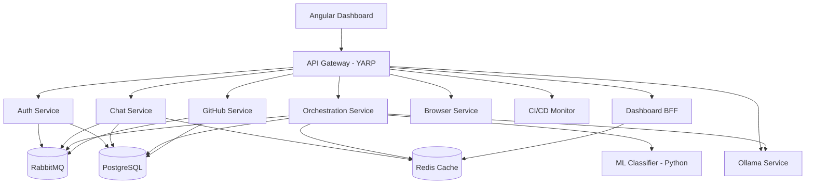

# 🤖 Coding Agent - AI-Powered Microservices Platform

[](https://dotnet.microsoft.com/)
[](https://angular.io/)
[](https://www.python.org/)
[](https://www.docker.com/)
[](LICENSE)

> **An enterprise-grade AI coding assistant built with microservices architecture**

A sophisticated coding assistant platform that combines real-time chat, task orchestration, ML-powered classification, and automated GitHub operations—all built with modern microservices principles.

---

## 🌟 Features

- **💬 Real-time Chat** - SignalR-powered WebSocket communication
- **🤖 AI Task Orchestration** - Intelligent agent coordination and execution
- **🧠 ML Classification** - Hybrid heuristic + ML task categorization
- **🔧 GitHub Integration** - Automated repository operations and PR management
- **🌐 Browser Automation** - Playwright-powered web interaction
- **📊 CI/CD Monitoring** - Build tracking and automated fixes
- **📈 Observability** - OpenTelemetry with Prometheus, Grafana, and Jaeger
- **🚀 Scalable Architecture** - Independent service deployment and scaling

---

## 🏗️ Architecture

### Microservices (10 Services)



### Technology Stack

| Layer | Technology |
|-------|-----------|
| **Backend** | .NET 9 Minimal APIs, Python FastAPI |
| **Frontend** | Angular 20.3 + NgRx Signal Store |
| **Gateway** | YARP (Yet Another Reverse Proxy) |
| **Messaging** | RabbitMQ + MassTransit |
| **Database** | PostgreSQL (per-service schemas) |
| **Cache** | Redis |
| **Real-time** | SignalR (WebSocket) |
| **Observability** | OpenTelemetry → Prometheus + Grafana + Jaeger |
| **Deployment** | Docker Compose (dev), Kubernetes (prod) |

---

## 📚 Documentation

Comprehensive documentation is available in the [`docs/`](./docs) directory:

### Architecture Guides
- **[📖 Overview](./docs/00-OVERVIEW.md)** - System architecture and design decisions
- **[📋 Service Catalog](./docs/01-SERVICE-CATALOG.md)** - Detailed service specifications
- **[🗓️ Roadmap](./docs/02-IMPLEMENTATION-ROADMAP.md)** - 6-month implementation plan
- **[📁 Solution Structure](./docs/03-SOLUTION-STRUCTURE.md)** - Monorepo layout and CI/CD
- **[🧠 ML & Orchestration ADR](./docs/04-ML-AND-ORCHESTRATION-ADR.md)** - ML architecture decisions
- **[⚡ Quick Start](./docs/QUICK-START.md)** - Quick reference guide

### Deployment & Operations
- **[🐳 Docker Guide](./deployment/docker-compose/README.md)** - Complete Docker setup (dev + prod)
- **[⚡ Docker Quick Start](./deployment/docker-compose/DOCKER-QUICK-START.md)** - Common commands
- **[📦 Docker Implementation](./deployment/docker-compose/DOCKER-IMPLEMENTATION-SUMMARY.md)** - Technical details
- **[🚨 Alerting Setup](./deployment/docker-compose/ALERTING-SUMMARY.md)** - Monitoring & alerts
- **[📖 Runbooks](./docs/runbooks/)** - Operational procedures

### API Documentation
- **[🔐 Auth Service API](./docs/api/auth-service-openapi.yaml)** - Authentication endpoints (OpenAPI 3.0)
- **[💬 Chat Service API](./docs/api/chat-service-openapi.yaml)** - Chat and messaging endpoints
- **[🌐 Gateway API](./docs/api/gateway-openapi.yaml)** - Gateway routing configuration
- OpenAPI/Swagger endpoints available on each service

### Authentication & Security
- **[🔑 Auth Implementation Guide](./docs/AUTH-IMPLEMENTATION.md)** - Complete authentication documentation
  - Architecture and security design
  - API endpoints with curl examples
  - JWT token structure and claims
  - OWASP Top 10 alignment
  - Deployment and troubleshooting
- **[🛡️ E2E Auth Tests](./docs/AUTH-E2E-TEST-SUMMARY.md)** - Frontend authentication test coverage

### Contributing
- **[Contributing Guide](./.github/CONTRIBUTING.md)** - How to contribute
- **[Code of Conduct](./.github/CODE_OF_CONDUCT.md)** - Community guidelines
- **[Security Policy](./.github/SECURITY.md)** - Reporting vulnerabilities
- **[Copilot Guide](./.github/COPILOT.md)** - GitHub Copilot best practices

---

## 🚀 Quick Start

### Prerequisites

- **.NET 9 SDK** - [Download](https://dotnet.microsoft.com/download/dotnet/9.0)
- **Node.js 20+** - [Download](https://nodejs.org/)
- **Python 3.11+** - [Download](https://www.python.org/)
- **Docker Desktop** - [Download](https://www.docker.com/products/docker-desktop)
- **Git** - [Download](https://git-scm.com/)

### Clone & Setup

```bash
# Clone the repository
git clone https://github.com/JustAGameZA/coding-agent.git
cd coding-agent
```

### Run with Docker (Recommended)

**Development Mode** (with hot reload):
```bash
cd deployment/docker-compose

# Start infrastructure + all services
docker compose -f docker-compose.yml -f docker-compose.apps.dev.yml up

# Access services:
# - Gateway API: http://localhost:5000
# - Angular UI: http://localhost:4200
# - Grafana: http://localhost:3000 (admin/admin)
# - Jaeger: http://localhost:16686
```

**Production Mode** (optimized builds):
```bash
cd deployment/docker-compose

# Build and start all services
docker compose -f docker-compose.yml -f docker-compose.apps.prod.yml up --build -d

# Check status
docker compose ps
```

**Documentation:**
- 📚 [Complete Docker Guide](./deployment/docker-compose/README.md)
- ⚡ [Quick Start Commands](./deployment/docker-compose/DOCKER-QUICK-START.md)
- 🛠️ [Implementation Details](./deployment/docker-compose/DOCKER-IMPLEMENTATION-SUMMARY.md)

### Authentication Setup

The platform uses JWT-based authentication with BCrypt password hashing.

**Test User Registration**:
```bash
# Register a new user
curl -X POST http://localhost:5000/api/auth/register \
  -H "Content-Type: application/json" \
  -d '{
    "username": "testuser",
    "email": "test@example.com",
    "password": "Test@1234",
    "confirmPassword": "Test@1234"
  }'

# Response includes JWT tokens
{
  "accessToken": "eyJhbGci...",
  "refreshToken": "jZXN0IHR...",
  "expiresIn": 900,
  "tokenType": "Bearer"
}
```

**Login**:
```bash
# Login with username and password
curl -X POST http://localhost:5000/api/auth/login \
  -H "Content-Type: application/json" \
  -d '{
    "username": "testuser",
    "password": "Test@1234"
  }'
```

**Using JWT Tokens**:
```bash
# Use access token in Authorization header
curl -X GET http://localhost:5000/api/auth/me \
  -H "Authorization: Bearer eyJhbGci..."
```

**Configuration**:
```bash
# Required environment variables for Auth Service
export Jwt__Secret=$(openssl rand -base64 64)
export ConnectionStrings__AuthDb="Host=localhost;Database=coding_agent;..."
export RabbitMQ__Host=localhost
```

**Security Features**:
- ✅ BCrypt password hashing (work factor 12)
- ✅ JWT access tokens (15-minute expiry)
- ✅ Refresh tokens (7-day expiry with rotation)
- ✅ Session management with IP tracking
- ✅ Strong password policy enforcement
- ✅ Rate limiting (Gateway: 10 login attempts/min per IP)

**Documentation**: See [Auth Implementation Guide](./docs/AUTH-IMPLEMENTATION.md) for complete details.

### Admin Features

The platform includes role-based admin features for user management.

**Default Admin User** (Development only):
```bash
# Seed admin user
.\seed-admin-user.ps1 -Email "admin@example.com" -Password "Admin@1234"

# Login as admin
Username: admin
Password: Admin@1234
```

⚠️ **Security Warning**: Change the default admin password immediately in production!

**Admin Capabilities**:
- ✅ View all users (paginated list with search/filter)
- ✅ Manage user roles (add/remove Admin role)
- ✅ Activate/deactivate user accounts
- ✅ View user details and session count
- ✅ Monitor infrastructure health

**Admin Pages**:
- **User Management**: `http://localhost:4200/admin/users`
- **Infrastructure**: `http://localhost:4200/admin/infrastructure`

**API Endpoints** (require `Admin` role in JWT):
```bash
# Get all users
GET /api/auth/admin/users?page=1&pageSize=20

# Update user roles
PUT /api/auth/admin/users/{id}/roles
{"roles": ["Admin", "User"]}

# Deactivate user
PUT /api/auth/admin/users/{id}/deactivate
```

**Documentation**:
- 🔐 [Admin Implementation Summary](./ADMIN-FEATURES-IMPLEMENTATION-SUMMARY.md)
- 🧪 [E2E Admin Tests](./E2E-ADMIN-TESTS-SUMMARY.md)
- 📋 [QA Deliverables](./QA-DELIVERABLES-ADMIN-E2E.md)

--- Development Roadmap

**Current Status**: ✅ Phase 3 Complete (Integration Services)
**Current Phase**: Phase 4 - Frontend & Dashboard (Starting)

| Phase | Timeline | Status |
|-------|----------|--------|
| Phase 0: Architecture & Planning | Weeks 1-2 | ✅ Complete |
| Phase 1: Infrastructure & Gateway | Weeks 3-6 | ✅ Complete |
| Phase 2: Core Services | Weeks 7-12 | ✅ Complete |
| Phase 3: Integration Services | Weeks 13-18 | ✅ Complete |
| Phase 4: Frontend & Dashboard | Weeks 19-22 | ⏳ In Progress |
| Phase 5: Migration & Cutover | Weeks 23-24 | 📋 Planned |
| Phase 6: Stabilization & Docs | Weeks 25-26 | 📋 Planned |

**Progress**: 67% complete (4 of 6 phases done)
**Target Completion**: May 2026

---

## 🎯 Project Goals

### Technical Metrics
- ✅ **API Latency**: p95 < 500ms
- ✅ **Test Coverage**: 85%+ (unit + integration)
- ✅ **Build Time**: < 5 min per service
- ✅ **Deployment**: Daily per service
- ✅ **Availability**: 99.5%+ uptime

### Business Impact
- 🎯 **Feature Velocity**: 2x faster development
- 🎯 **Onboarding**: < 1 day for new developers
- 🎯 **Incident Recovery**: < 5 min
- 🎯 **Cost Efficiency**: 30% reduction via independent scaling

---

## 🤝 Contributing

We welcome contributions! Please see our [Contributing Guide](./.github/CONTRIBUTING.md) for details.

### Development Workflow
1. Fork the repository
2. Create a feature branch (`git checkout -b feature/amazing-feature`)
3. Commit your changes (`git commit -m 'feat: add amazing feature'`)
4. Push to the branch (`git push origin feature/amazing-feature`)
5. Open a Pull Request

---

## 📋 Project Status

### ✅ Completed (Phases 0-3)

**Phase 0: Architecture & Planning**
- ✅ Complete service catalog and specifications (78 KB documentation)
- ✅ Solution structure with 16 projects and 8 services
- ✅ Architecture Decision Records (ADRs)

**Phase 1: Infrastructure & Gateway**
- ✅ YARP Gateway with JWT auth and rate limiting
- ✅ PostgreSQL + Redis + RabbitMQ + Ollama in Docker Compose
- ✅ OpenTelemetry → Prometheus + Grafana + Jaeger observability stack
- ✅ Automated alerting and health monitoring

**Phase 2: Core Services**
- ✅ Chat Service (141 unit tests, SignalR hub, Redis caching)
- ✅ Orchestration Service (214 unit tests, 3 execution strategies)
- ✅ ML Classifier Service (145 tests, hybrid heuristic+ML+LLM)

**Phase 3: Integration Services**
- ✅ GitHub Service (57 tests, PR management + webhooks)
- ✅ Browser Service (Playwright automation)
- ✅ CI/CD Monitor (automated fix generation)
- ✅ Ollama Service (hardware-aware model selection)

**Total Test Coverage**: 532+ unit tests across all services

### 🚧 In Progress (Phase 4)

- Dashboard Service (BFF) - minimal scaffold with observability
- Angular Dashboard - basic routing + Material UI setup
- Service integration and E2E testing

### 📋 Upcoming (Phases 5-6)
- Full infrastructure stack (Phase 1)
- Core service implementation (Phase 2)
- Frontend dashboard (Phase 4)

---

## 📄 License

This project is licensed under the MIT License - see the [LICENSE](LICENSE) file for details.

---

## 🙏 Acknowledgments

This project was designed with assistance from:
- **GitHub Copilot** - AI-assisted architecture and development
- **Microsoft eShopOnContainers** - Microservices inspiration
- **Clean Architecture** - Domain-driven design principles
- **.NET Community** - Best practices and patterns

---

## 📞 Support & Community

- **Documentation**: [docs/](./docs)
- **Issues**: [GitHub Issues](https://github.com/zerith-jag/coding-agent/issues)
- **Discussions**: [GitHub Discussions](https://github.com/zerith-jag/coding-agent/discussions)

---

## 🔗 Related Links

- [.NET Documentation](https://docs.microsoft.com/dotnet/)
- [Angular Documentation](https://angular.io/docs)
- [MassTransit Documentation](https://masstransit.io/)
- [RabbitMQ Documentation](https://www.rabbitmq.com/documentation.html)
- [OpenTelemetry Documentation](https://opentelemetry.io/docs/)

---

<p align="center">
  <strong>🎯 Building the Future of AI Coding Assistants</strong>
</p>

<p align="center">
  Made with ❤️ by <a href="https://github.com/zerith-jag">zerith-jag</a>
</p>

<p align="center">
  <sub>Last Updated: October 24, 2025</sub>
</p>
